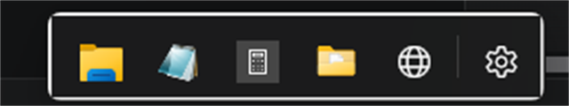
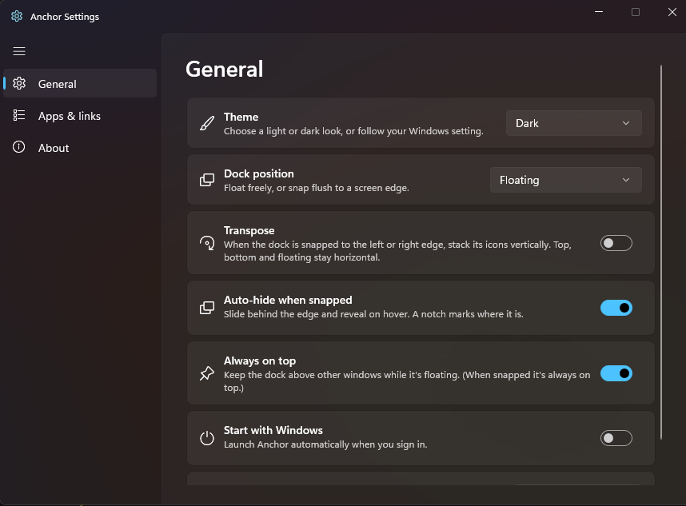

# Anchor

[](https://github.com/framedparadox/anchor-dock/releases/latest)
[](LICENSE)
[](#requirements)
[](#requirements)

A floating dock for Windows 11, built with **WinUI 3 / Windows App SDK**. It floats a
compact, glass "strip" above the taskbar that holds apps, files, folders, and web links —
launch anything with a click. Run one, or one per monitor.

The glass is the **real Windows 11 acrylic material** (the same `DesktopAcrylicBackdrop`
the shell uses), so it blurs the desktop behind it. Pick a **light**, **dark** (default) or
**system-following** theme from Settings.



Free and open source (MIT). No accounts, no telemetry, no ads and no admin rights — out of the box
the only thing Anchor sends over the network is a request for a web link's favicon, and the one
other thing that ever could (an update check) is off until you switch it on (see
[Privacy & data](#privacy--data)).

---

## Table of contents

- [Features](#features)
- [Install](#install)
- [Requirements](#requirements)
- [Build & run](#build--run)
- [Tests](#tests)
- [Using it](#using-it)
- [Run / debug in VS Code](#run--debug-in-vs-code)
- [Configuration](#configuration)
- [Privacy & data](#privacy--data)
- [Security notes](#security-notes)
- [Troubleshooting](#troubleshooting)
- [Architecture](#architecture)
- [FAQ](#faq)
- [Known limitations](#known-limitations)
- [Roadmap / future enhancements](#roadmap--future-enhancements)
- [Contributing](#contributing)
- [Credits & support](#credits--support)
- [License](#license)

---

## Features

- **Glass background** — Windows 11 taskbar-style acrylic. Real desktop blur, kept
  translucent even though a dock is never the focused window (see *Architecture*), with the
  DWM border rim suppressed so there's no outline around the rounded glass in any theme.
- **Theme** — choose **Light**, **Dark** (default) or **System** (follow the Windows setting)
  from Settings ▸ General. The dock, its glass and the Settings/Add windows all switch together;
  a High Contrast accessibility theme always overrides it.
- **Rounded corners** — the native Windows 11 window rounding (DWM).
- **Taskbar-sized icons** — 24 px icons in 40 px cells by default, matching the Windows 11
  taskbar; Settings ▸ Appearance offers a smaller and a larger size too.
- **Tray icon** — Anchor sits in the notification area while it runs. **Left-click** brings the
  dock to the front (even when it's tucked behind a screen edge); **right-click** gives you
  *Show/Hide dock*, *Search…*, *Add new…*, *Settings…* and *Quit Anchor*. Since the dock is
  deliberately off the taskbar and Alt-Tab, this is the always-available handle on a running
  Anchor — and it re-adds itself if Explorer restarts.
- **Global keyboard shortcut** — a system-wide hotkey (**Ctrl+Alt+A** by default) summons the
  dock: it un-hides it, slides it back out from its edge, raises it above other windows and gives
  it focus. Re-assign it in Settings ▸ Shortcuts by clicking the shortcut button and pressing the
  combination you want (Esc cancels, Backspace clears); Anchor tells you if another app already
  owns it. At least one of Ctrl / Alt / Win is required.
- **Eight languages** — English, Deutsch, Español, Français, हिन्दी, 日本語, Português (Brasil) and
  简体中文. Anchor follows your Windows display language by default, or pin one in
  Settings ▸ General; the change applies immediately, with no restart.
- **Several docks, one per monitor if you like** — add a dock from any dock's right-click menu or
  Settings ▸ Docks. Each has its own items, monitor, edge, auto-hide and always-on-top setting;
  theme, language, the global shortcut and start-with-Windows stay shared. The tray icon and the
  shortcut summon them all at once.
- **Groups** — club related apps, files or links into one dock icon, keeping a long dock short.
  Clicking it opens a **fly-out bar**: a second dock growing out of that icon — the same cells,
  glass and spacing as the strip itself, running across the dock's flow (vertical out of a
  horizontal dock, horizontal out of a side-snapped one) and always away from the edge it's
  snapped to. Fill a group by **dragging an icon onto it**, or with *Move to group* on an item's
  right-click menu; drag a cell sideways out of an open bar to put it back on the strip. A group's
  own menu offers *Ungroup*.
- **Folder fly-outs** — turn on *Show folder contents* for a folder and it lists what's inside it
  in the same bar instead of opening Explorer, macOS-stack style. Click a subfolder to drill in,
  right-click an entry to pin it to the dock, and the last cell always opens the real folder in
  File Explorer.
- **Quick-launch search** — assign a shortcut in Settings ▸ Shortcuts and it opens a small glass
  card that filters every item on every dock. Type, arrow to the one you want, Enter to launch;
  Esc or clicking away dismisses it. Also on the dock's and the tray's right-click menus, so it is
  reachable before you have assigned a shortcut.
- **Per-item shortcuts** — give any icon its own system-wide combination from *Shortcut* on its
  right-click menu, including items tucked inside a group. Off by default behind one master switch,
  since every shortcut claims a combination from every other app; Settings ▸ Shortcuts lists the
  ones you've assigned.
- **Icon size, glass and magnification** — Settings ▸ Appearance offers **Small / Medium / Large**
  cells (Medium matches the taskbar), a frostiness slider for the acrylic, an **accent tint**
  switch, and macOS-style **magnification** that swells icons under the cursor.
- **Drop a file onto an icon** — dropping a file on an **app** opens it with that app, the way
  dropping it on an exe in Explorer does; dropping one on a **group** files it in there. The target
  icon swells to say which will happen.
- **Move items between docks** — *Move to dock* on an item's menu re-homes it without losing its
  custom icon, arguments or shortcut.
- **Import / export** — Settings ▸ General saves every dock, item and setting to a file and
  restores one, which is how you move a dock to another PC.
- **Opt-in update check** — off by default; when you turn it on, Anchor asks GitHub whether a
  newer release exists and offers you the download page. It never downloads or installs anything
  (see [Privacy & data](#privacy--data)).
- **Running-app indicators** — a dot under an app that's already open, and a click that brings its
  window forward instead of starting a second copy. **Shift+click** starts a new instance anyway,
  the way the Windows 11 taskbar does. Turn the whole thing off in Settings ▸ General.
- **Separators** — a thin divider you can drop anywhere on the strip to group icons visually.
  Add one from the dock's right-click menu or the Add window; drag it like any other item.
- **Custom icons** — *Change icon…* on an item's right-click menu points it at any PNG / ICO / JPG
  / BMP / GIF, and *Use the default icon* puts the shell or favicon icon back.
- **Settings window** — a gear button opens a Windows-Settings-style window (Mica, left
  navigation) with a **General** page (theme, language, running-app indicators, start-with-Windows,
  update check, import/export, reset), an **Appearance** page (icon size, glass, accent tint,
  magnification), a **Shortcuts** page (the summon shortcut, quick-launch search, and the master
  switch plus a list for per-item shortcuts), a **Docks** page (one card per dock: name, monitor,
  position, transpose-on-side-edges, auto-hide, always-on-top, remove), an **Apps & links** page
  that lists every entry — grouped by dock, with a group's contents indented — with a show/hide
  switch and a remove button, and an **About** page (version + a plain-language privacy summary).
- **Add-to-Dock window** — a Windows-app-style modal for adding an **app / file / folder / web
  link / shortcut / separator / group**, with a type picker, Browse, and auto-suggested names.
- **Automatic icons** — apps, files and folders use the Windows shell icon (the same icon
  Explorer shows); web links auto-fetch the site's **favicon**, cached to disk so it downloads
  once and still shows offline.
- **Drag & drop to add** — drag an app, shortcut (`.lnk`), file or folder from Explorer or the
  desktop straight onto the dock to add it; a URL dragged from a browser becomes a web link.
- **Reorder by dragging** — drag an icon left/right (or up/down when vertical) to rearrange it;
  dragging the dock's background moves the whole dock (the two gestures never conflict).
- **Snap to any edge → hides where you left it** — drop the dock near a screen edge and it snaps
  flush and auto-hides behind *that* edge on *that* monitor, revealing on cursor approach. It
  tucks behind the physical screen edge — at the bottom that means **behind the taskbar**, with
  only a small **notch** peeking over it — stays at the position you placed it along the edge (no
  jumping to center), and reveals when you reach the edge (or the notch). On an edge **shared with
  another monitor** it stays pinned and visible instead of sliding into the neighboring screen.
- **Transpose (optional)** — a Settings toggle makes the dock stack its icons
  vertically when snapped to the **left or right** edge; top, bottom and floating stay horizontal.
- **Always on top (optional)** — the dock stays above other windows; a Settings toggle lets you
  turn that off while it's floating (when snapped it stays on top so the auto-hide reveal works).
- **Show / hide without deleting** — hide items from the dock (Settings ▸ Apps, or an icon's
  right-click menu) while keeping them in the list.
- **Empty state** — with no items the dock shows a **"＋ Add New"** button.
- **Per-item menu** — right-click an icon: Open, Edit, Rename, Change icon, Show folder contents
  (folders), Move to group, Move to dock, Shortcut, Move left/right, Hide, Remove.
- **Keyboard & screen-reader friendly** — items and the gear are real `Button`s: Tab / arrow-key
  focus, Space/Enter to launch, focus visuals, and Narrator names. Context menus are reachable
  with the Menu key / Shift+F10; auto-hide honors the *reduced-motion* and *high-contrast*
  accessibility settings.
- **Single instance** — launching Anchor a second time (e.g. from the Start menu while the
  "start with Windows" copy is already running) quietly exits rather than stacking a second set of
  docks. Scoped to the data directory, so a portable copy with its own `ANCHOR_DATA_DIR` still runs.
- **Persistent** — items, position, snap state and settings are saved to JSON and restored next launch.
- **Out of the way** — borderless, always-on-top, hidden from the taskbar and Alt-Tab.

The Settings window (Mica, Windows-Settings-style navigation):



## Install

Anchor is **portable** — there is no installer, no setup wizard and nothing written outside your
own user profile.

1. Download **`Anchor-win-x64-<version>.zip`** — or **`Anchor-win-arm64-<version>.zip`** on a
   Windows-on-ARM machine — from the
   [latest release](https://github.com/framedparadox/anchor-dock/releases/latest).
2. Extract it to a folder you intend to keep (e.g. `%LocalAppData%\Programs\Anchor`) — Anchor runs
   from where you unzip it, so don't launch it out of the Downloads/temp folder.
3. Run **`Anchor.exe`**. The dock appears above the taskbar and an anchor icon appears in the
   notification area.
4. Optional: turn on **Settings ▸ General ▸ Start with Windows** so it comes back after a reboot.

Notes:

- The zip is a **self-contained** build — ~86 MB compressed, ~215 MB on disk once extracted. It
  carries .NET 10 and the Windows App SDK with it, so nothing else has to be installed.
- Releases are **not code-signed yet**, so SmartScreen may show "Windows protected your PC" the
  first time — choose *More info ▸ Run anyway*. To verify the download instead of trusting it, the
  expected SHA-256 is published in
  [`ajaykontham.Anchor.installer.yaml`](packaging/winget/manifests/a/ajaykontham/Anchor/1.0.0/ajaykontham.Anchor.installer.yaml);
  compare it with `Get-FileHash Anchor-win-x64-1.0.0.zip`.
- **Updating** — quit Anchor (tray ▸ *Quit Anchor*), extract the new zip over the old folder, start
  it again. Your dock lives in `%AppData%\Anchor` and is untouched by the swap.
- **Uninstalling** — quit Anchor, turn off *Start with Windows* first (or delete the `Anchor` value
  under `HKCU\Software\Microsoft\Windows\CurrentVersion\Run`), then delete the extracted folder and
  `%AppData%\Anchor`.

A `winget` package (`ajaykontham.Anchor`) is prepared but not yet accepted into the public
`microsoft/winget-pkgs` repository, so for now the release zip is the way to install.

## Requirements

- Windows 11 (tested on build 26200) — Windows 10 1809+ (build 17763) should also work; that is
  the app's `TargetPlatformMinVersion`.
- **x64 or ARM64.** WinUI cannot target `AnyCPU`, so each is a separate build: pass
  `-p:Platform=x64` (the default) or `-p:Platform=ARM64`, and the runtime identifier follows. There
  is no x86 build. The ARM64 build cross-compiles from an x64 host, but only the x64 one can be
  smoke-tested there — an ARM64 release should be tried on real hardware before it ships.
- No admin rights, at install or at run time.
- To *build* it: the **.NET 10 SDK**. The build is **self-contained**, so the Windows App Runtime
  does **not** need to be installed separately — on either your machine or a user's.

## Build & run

```powershell
# from the repo root
dotnet build src/Anchor/Anchor.csproj -c Release -p:Platform=x64

# run it
./src/Anchor/bin/x64/Release/net10.0-windows10.0.19041.0/win-x64/Anchor.exe

# natively for Windows on ARM (cross-compiles fine from an x64 host)
dotnet build src/Anchor/Anchor.csproj -c Release -p:Platform=ARM64
```

> WinUI apps cannot target `AnyCPU`; always pass `-p:Platform=x64` or `-p:Platform=ARM64` for a
> single project. The runtime identifier is derived from `Platform` in the csproj, so the two can
> never drift apart. The whole solution builds with `dotnet build Anchor.slnx -c Release` (x64 is
> the default — don't add `-p:Platform=x64` at the solution level, which trips MSBuild's
> solution-configuration mapping).

To produce the distributable, self-contained folders and zips (what a release ships):

```powershell
pwsh scripts/package-release.ps1                     # both architectures, version from the csproj
pwsh scripts/package-release.ps1 -Version 1.1.0
pwsh scripts/package-release.ps1 -Architecture x64   # or arm64
```

It publishes to `publish\Anchor-win-<arch>\`, zips each to `dist\Anchor-win-<arch>-<version>.zip`
and prints each zip's SHA-256. The version comes from
[`src/Anchor/Anchor.csproj`](src/Anchor/Anchor.csproj) — bump `<Version>`, `<FileVersion>` and
`<AssemblyVersion>` together, since Settings ▸ About reads the assembly version.

## Tests

There are two suites. The unit tests are the ones you run constantly; the UI smoke tests need a
real desktop and are opt-in.

```powershell
dotnet test tests/Anchor.Tests/Anchor.Tests.csproj -p:Platform=x64   # fast, headless
pwsh scripts/run-ui-tests.ps1                                        # launches the real app
```

`tests/Anchor.Tests/` covers the pure-logic pieces (`Models/`, `Services/DockItemFactory.cs`,
`Services/Loc.cs`, `Services/DockStore.cs`, `Services/UpdateService.cs`, `Services/ItemSearch.cs`,
`Services/FolderListing.cs`) with xUnit — the
`Kind → Glyph` mapping, cell sizing (including the density setting and the magnification clamp)
and property-change notifications on `DockItem`, the first-run defaults, dock-profile round-trip
and **upgrade-from-single-dock migration** of `DockConfig`, the defaults every new setting has to
keep so an upgrade doesn't change the dock under you, export/import round-tripping (and its refusal
to import a file that isn't an Anchor config), release-tag parsing, `DockItemFactory` classification
/ name suggestion, quick-launch ranking (a name match has to beat an item that merely matches by
path), a folder stack's ordering and hidden-file exclusion against a real directory, the command
line built when files are dropped on an app (a path with spaces must stay one argument), the
magnification curve, `HotkeyGesture` parsing / rendering / registrability, and the translation tables
(every language defines every English key, no blanks, no strays, matching `{0}` placeholders) plus
language resolution. It targets the same Windows-qualified TFM as the app (WinUI types like
`ImageSource` require it), so — like the app itself — it only builds and runs on Windows.

`tests/Anchor.UITests/` is the smoke harness for the shell / Win32 / live-XAML paths the unit
tests can't reach: it launches the **published** `Anchor.exe` and drives it through UI Automation
(via [FlaUI](https://github.com/FlaUI/FlaUI)'s UIA3 client), checking that the dock window appears,
that the seeded items render as named, invokable buttons, that the gear opens Settings and its
pages switch, that the Docks, Appearance and Shortcuts pages build their controls, that a group
opens a fly-out bar with its children in it, and that closing Settings doesn't take the dock down
with it. Notes:

- It is **not** in `Anchor.slnx`, so `dotnet build` / `dotnet test` on the solution stays exactly
  as fast and side-effect-free as before. `scripts/run-ui-tests.ps1` publishes the app, points
  `ANCHOR_EXE` at it and sets `ANCHOR_UITESTS=1`; without those the tests skip rather than fail.
- It needs an **interactive desktop** — a signed-in session with a visible desktop. It won't pass
  over a lock screen or on a headless CI agent.
- Each test runs Anchor against a throwaway `ANCHOR_DATA_DIR` under `%Temp%`, so **your own dock is
  never touched** — which is what makes it safe to cover reset and remove-item paths.
- UI Automation rather than WinAppDriver or Appium: no background server to install and keep
  running, no Node/npm, no protocol-version matching between client and driver, and UIA3 talks to
  WinUI 3's automation peers directly.

The network / registry pieces (`IconService`'s favicon fetch, `StartupService`) remain
integration-shaped and are verified by manual testing (see *Using it*); the reasoning is
documented in `docs/design-guidelines-review.md`.

## Using it

- **Left-click** an icon to launch it (Space/Enter when it has keyboard focus works too). If that
  app is already open, the click brings its window forward instead — **Shift+click** to start a new
  instance anyway.
- **Click a group** to open its fly-out bar — a second dock out of that icon — then click
  anything inside it. A folder with *Show folder contents* on opens the same bar over its contents.
- **Hover** an icon for a Windows 11 taskbar-style highlight, or turn on
  Settings ▸ Appearance ▸ *Magnify on hover* for a macOS-style swell.
- **Drag an icon** to reorder it, **onto a group** to file it in there, or **sideways out of an
  open group bar** to put it back on the strip. **Drag the dock's background** (the padding around
  the icons, the divider, or the gear) to move the whole dock; drop it *at* a screen edge to snap
  and auto-hide behind that edge, or anywhere else to float.
- **Drag a file from Explorer** onto the dock to add it, onto an **app icon** to open it with that
  app, or onto a **group** to file it in there. The target icon swells to show which it will be.
- **Right-click an icon** → *Open, Edit…, Rename…, Change icon…, Move to group ▸, Move to dock ▸,
  Shortcut ▸, Move left, Move right, Hide, Remove* — plus *Show folder contents* on a folder. A
  group instead offers *Open group, Rename…, Change icon…, Ungroup*; a separator only the
  placement and removal commands.
- **Gear button** → opens **Settings** (General + Appearance + Shortcuts + Docks + Apps & links +
  About).
- **Right-click the dock background** → *Add New…*, *Add separator*, *New group…*, *Search…*,
  *Settings…*, *Snap to edge*, *Float (unsnap)*, *Add another dock*, *Remove this dock*, *Quit*.
- **Tray icon** (notification area) → **left-click** to bring every dock to the front;
  **right-click** for *Show/Hide dock*, *Search…*, *Add new…*, *Settings…*, *Quit Anchor*.
- **Ctrl+Alt+A** (default) from anywhere brings the docks to the front — the quickest way back to a
  dock that's auto-hidden behind an edge. Change or clear it in Settings ▸ Shortcuts, where you can
  also assign a shortcut for **quick-launch search** and switch on **per-item shortcuts**.

Because the dock stays off the taskbar, everything (including **Quit**) lives in the gear/settings,
the right-click menu and the tray icon. When snapped, move the cursor to that edge (within the
dock's span) — or onto the notch — to reveal it, or just press the shortcut.

## Run / debug in VS Code

Open the repo in VS Code and press **F5** (*Launch Anchor*), or run the **build** task
(`Ctrl+Shift+B`). Both are configured in `.vscode/` for the required `x64` platform.

## Configuration

All state is saved to a single JSON file:

```
%AppData%\Anchor\dock.json
```

Delete this file to reset the dock to its seeded defaults. Downloaded favicons are cached
separately under `%AppData%\Anchor\IconCache\` (one `<host>.ico` per site); deleting that folder
just forces the icons to be re-fetched.

Set **`ANCHOR_DATA_DIR`** to put both somewhere else — a folder on a removable drive for a truly
portable copy, or a throwaway folder for testing. It also scopes the single-instance check, so a
copy with its own data directory runs alongside your everyday one instead of quietly exiting.

The file is written atomically (write-to-temp then rename) so a crash mid-save can't corrupt it.
Enums are stored **by name**, and unset optional fields are omitted, so an older file still loads
after an upgrade (a missing `Theme`, for instance, defaults back to `Dark`).

**Upgrading from a single-dock config.** Before Anchor supported more than one dock, the items and
placement sat at the top level of this file. Such a file still loads: on first launch its dock is
folded into `Docks[0]` with every setting intact, and the file is rewritten in the new shape once,
right then. Nothing is lost, and nothing needs doing by hand.

<details>
<summary>Example <code>dock.json</code> (and field reference)</summary>

```jsonc
{
  // ---- Per-dock: one entry per strip on screen ----
  "Docks": [
    {
      "Id": "cc25…",                  // stable GUID (generated once per dock)
      "Name": "Left screen",          // shown in Settings ▸ Docks; "" = "Dock 1", "Dock 2", …
      "Items": [
        {
          "Id": "8f3c…",             // stable GUID (generated once per item)
          "Kind": "Application",     // Application | File | Folder | WebLink | Separator | Group
          "DisplayName": "Notepad",  // shown in the tooltip / Settings list
          "Target": "C:\\Windows\\System32\\notepad.exe", // path, or URL for a WebLink
          "Arguments": "notes.txt",  // optional, apps only; omitted when empty
          "CustomIconPath": null,    // optional icon overriding the shell/favicon one
          "CustomGlyph": null,       // optional built-in glyph from the icon picker (exclusive
                                     //   with CustomIconPath)
          "Hidden": false,           // true = kept in the list but not drawn on the dock
          "Hotkey": "Ctrl+Alt+1",    // optional per-item shortcut; only live when
                                     //   ItemHotkeysEnabled is true. Omitted when unset
          "FolderFlyout": false,     // Folder only: list the contents in a fly-out bar instead
                                     //   of opening Explorer
          "Children": []             // Group only: the items in its fly-out bar. Groups don't nest
        }
      ],
      "Snapped": false,              // true = flush to Edge; false = floating at FreeX/FreeY
      "Edge": "Bottom",              // Bottom | Top | Left | Right
      "FreeX": 640,                  // last top-left (physical px); also the snap anchor,
      "FreeY": 900,                  //   and what decides which monitor this dock is on
      "AutoHide": true,              // when snapped, slide behind the edge and reveal on hover
      "AlwaysOnTop": true,           // keep above other windows while floating
      "VerticalWhenSideSnapped": false // "Transpose": vertical icons on the left/right edge
    }
  ],

  // ---- App-wide: shared by every dock ----
  "LaunchAtStartup": false,      // mirrors the per-user HKCU Run key
  "Theme": "Dark",               // Light | Dark | System
  "ShowRunningIndicators": true, // dot under an open app + click-to-focus (Shift+click = new)
  "Language": "",                // "" = follow Windows; else en|de|es|fr|hi|ja|pt|zh-Hans
  "Hotkey": "Ctrl+Alt+A",        // summon-the-docks shortcut; "" = none. Ctrl/Alt/Shift/Win + key
  "HotkeyEnabled": true,         // register Hotkey with Windows (off keeps the combination)
  "SearchHotkey": "",            // quick-launch search shortcut; "" = none (the default)
  "ItemHotkeysEnabled": false,   // master switch for the per-item Hotkey fields above
  "Density": "Medium",           // Small | Medium | Large — icon and cell size
  "GlassOpacity": 0.9,           // acrylic frostiness, 0.3–1.0
  "AccentTint": false,           // tint the glass with the Windows accent colour
  "Magnify": false,              // swell icons under the cursor
  "CheckForUpdates": false,      // opt-in: ask GitHub for a newer release at startup
  "SkippedUpdate": "",           // a version the user chose not to be reminded about
  "Seeded": true                 // defaults have been seeded (prevents re-seeding an emptied dock)
}
```

You can hand-edit this file while Anchor is closed. `LaunchAtStartup` is the app's view of the
Windows startup entry; the source of truth is the `Anchor` value under
`HKCU\Software\Microsoft\Windows\CurrentVersion\Run`, which the Settings toggle writes.

A dock has no monitor field on purpose: which screen it lives on is simply the one `FreeX`/`FreeY`
fall on. That survives a reboot, a resolution change and a monitor being unplugged and plugged
back in far better than any display id would, and it means Settings ▸ Docks ▸ *Monitor* only has
to write coordinates.

Shortcuts (`Hotkey`, `SearchHotkey` and an item's own `Hotkey`) are stored as readable text
(`Ctrl+Alt+A`) rather than key codes, so they stay legible. Assignable keys are `A`–`Z`, `0`–`9`,
`F1`–`F24`, `Space`, `Enter`, `Tab`, `Backspace`, `Insert`, `Delete`, `Home`, `End`, `PageUp`,
`PageDown` and the four arrow keys; at least one of `Ctrl`, `Alt` or `Win` is required. A value
Anchor can't parse is treated as "no shortcut" — it never stops the config from loading.

**This file is also the backup format.** Settings ▸ General ▸ *Backup* exports exactly this shape,
so an exported file can be dropped straight into `%AppData%\Anchor\dock.json` by hand, and a
`dock.json` copied off another machine imports without conversion. Importing replaces every dock,
item and app-wide setting at once; there is no merge and no undo.

The **icon cache is deliberately not part of a backup**: it holds nothing but downloaded favicons,
which the new machine re-fetches on its own. Custom icons *are* preserved, because
`CustomIconPath` points at your own image file — so if you're moving between machines, copy that
file across too (or use a built-in glyph from the icon picker, which travels inside the config).

</details>

## Privacy & data

Anchor runs entirely on your PC. There are **no accounts, no telemetry, no analytics, and no ads**.

- **Your data stays local.** Items, layout and settings live in `%AppData%\Anchor\dock.json`
  and never leave your device.
- **Web-link icons are the only network access by default.** For a web link, Anchor fetches the
  site's favicon — first directly from the site (`https://<host>/favicon.ico`), and only if that
  fails, from DuckDuckGo's icon service (`https://icons.duckduckgo.com/ip3/<host>.ico`), which
  receives just the site's domain. Nothing else is sent, and downloaded icons are cached under
  `%AppData%\Anchor\IconCache\` so a site is contacted at most once. If you never add a web link,
  Anchor makes no network requests at all.
- **The update check is the only other thing that can reach the network, and it is off until you
  turn it on.** With **Settings ▸ General ▸ Check for updates** enabled, Anchor asks the public
  GitHub releases API (`api.github.com/repos/framedparadox/anchor-dock/releases/latest`) once at
  startup whether a newer version exists. No token, no account, no identifier beyond the HTTP
  request itself; nothing is uploaded, and nothing is ever downloaded or installed for you — the
  most it does is open the release page in your browser. Leave the switch off and it never runs.
- **Launching is a hand-off to Windows.** Opening an item hands it to the shell exactly as
  double-clicking it in Explorer would; Anchor does not read your files' contents. A folder
  fly-out lists a folder's file *names* to draw its icons; it does not open the files.

The same summary is available in-app under **Settings ▸ About ▸ Privacy**.

## Security notes

- **Anchor is a launcher, so it starts programs you pin.** Items are launched through
  `ShellExecute` (`Process.Start` with `UseShellExecute=true`) — the same mechanism as an Explorer
  double-click. It only ever launches what *you* explicitly added (via the Add window or
  drag-and-drop) and persisted to your own user-profile config; it does not run undisclosed code.
  Because the config is a plain file under your `%AppData%`, protect it as you would any file that
  can start programs at sign-in.
- **Input is validated at the edges.** Web links are constrained to `http`/`https` on every path
  that creates one (the Add window and drag-and-drop); arbitrary URIs and shell commands
  (`ms-settings:`, `shell:…`) are only accepted through the explicit *Shortcut* type.
- **Favicon downloads are bounded.** Responses are size-capped (~2 MB) and content-sniffed by
  magic bytes before decoding, so a non-image response can't be shown as a broken/oversized image.
  The cache filename is derived from the sanitized host, not free-form text.
- **No elevation required.** "Start with Windows" uses the per-user `HKCU` Run key, so it never
  prompts for admin rights.

## Troubleshooting

- **Diagnostic log.** Anchor writes a lightweight log to `%Temp%\anchor.log` (truncated on each
  start). It records launches, icon-resolution fallbacks, and any otherwise-unhandled exception —
  the first place to look if something misbehaves.
- **An icon shows a globe/page glyph instead of a picture.** The shell thumbnail or favicon
  couldn't be resolved (e.g. the target no longer exists, or the site has no favicon / you're
  offline). Fix the target via the item's **Edit…** menu, or check connectivity for a web link.
- **The snapped dock seems to have vanished.** It auto-hid behind its edge — move the cursor to
  that screen edge (within the dock's span) or onto the small notch to reveal it. To stop it
  hiding, turn off **auto-hide** for that dock in **Settings ▸ Docks**.
- **A dock is off-screen after unplugging a monitor.** It gets clamped onto a remaining screen at
  the next layout; press **Ctrl+Alt+A** or click the tray icon to summon it. If it's still lost,
  **Settings ▸ Docks ▸ Monitor** re-centres it on the screen you pick.
- **An app that's clearly running has no dot.** The indicator needs a resolvable executable — a
  shortcut to a Store app or a control-panel item has none. It's also a 2-second poll, so give it
  a moment. Turn the feature off entirely in **Settings ▸ General**.
- **Reset everything.** Close Anchor and delete `%AppData%\Anchor\dock.json`, or use
  **Settings ▸ General ▸ Reset dock to defaults** (which asks for confirmation first, and closes
  any extra docks along with clearing the first).

## Architecture

```
src/Anchor/
  App.xaml(.cs)              App entry point; single-instance guard; creates the DockManager.
  DockManager.cs             Owns everything there is one of however many docks are on screen:
                             the config, tray icon, global shortcut, running-app poll, Settings
                             and Add windows; creates a DockWindow per DockProfile.
  DockWindow.xaml(.cs)       One dock strip: glass, chrome, layout, items, drag/reorder, menu.
  DockWindow.AutoHide.cs     Auto-hide controller (cursor polling, eased slide, hidden notch).
  DockWindow.FlyoutBar.cs    The fly-out bar: a second dock strip out of one icon. Shared by
                             groups and folder stacks; also the drag-out-of-a-bar gesture.
  DockWindow.Groups.cs       Groups: create/dissolve, the fly-out, and the "Move to group" menu.
  DockWindow.FolderFlyout.cs Folder stacks: a folder's contents rendered into a fly-out bar.
  DockWindow.DropTargets.cs  Dropping a file onto an app icon (open with) or a group (file into).
  DockWindow.MoveToDock.cs   Handing an item over to another dock.
  DockWindow.ItemHotkey.cs   The per-item shortcut menu and its capture flyout.
  DockWindow.IconPicker.cs   The glyph swatch grid + "browse for an image" picker.
  DockWindow.Magnify.cs      Cursor-follows magnification, and the glass personalization.
  SearchWindow.xaml(.cs)     Quick-launch search: a glass card filtering every item on every dock.
  SettingsWindow.xaml(.cs)   Windows-Settings-style window: General + Appearance + Shortcuts +
                             Docks + Apps & links + About.
  AddNewWindow.xaml(.cs)     Windows-app-style modal for adding an app/file/folder/link/shortcut/
                             separator/group.
  Controls/
    HotkeyCaptureButton.cs   A button that captures a key combination; shared by every shortcut UI.
  Models/
    DockItem.cs              One dock entry (kind, target, icon, hidden, shortcut, group children).
    DockProfile.cs           One dock: its items, edge, placement and hide behavior.
    DockConfig.cs            The docks + app-wide settings, with the single-dock upgrade path.
    DockMetrics.cs           Cell/icon geometry derived from the density setting — the one place
                             every surface reads its sizes from.
    HotkeyGesture.cs         A global shortcut: modifiers + key, parsed from / rendered to text.
  Services/
    AcrylicBackdropManager.cs  Applies + keeps-alive the taskbar-style acrylic.
    IconService.cs             Shell-thumbnail icons for apps/files/folders; cached favicons for links.
    Launcher.cs                ShellExecute-based launching (apps, files, URLs).
    RunningAppService.cs       Which pinned apps have a window open, and focusing those windows.
    RunningAppMonitor.cs       The poll behind that, shared by every dock.
    ShortcutResolver.cs        Resolves a .lnk to its target exe (IShellLinkW), so shortcuts match.
    DockStore.cs               JSON load/save of the config (atomic write); the data directory;
                               export/import to an arbitrary path.
    UpdateService.cs           The opt-in GitHub releases check (off by default; never installs).
    DockItemFactory.cs         Classifies a target (app/file/folder/link) and suggests a name.
    ItemSearch.cs              Quick-launch matching: which items a query finds, and in what order.
    FolderListing.cs           A folder's contents as dock items, in Explorer's order.
    Loc.cs                     The string table: language resolution + key lookup with fallback.
    MessageWindow.cs           Hidden HWND that receives tray callbacks and WM_HOTKEY.
    TrayIconService.cs         Notification-area icon and its native right-click menu.
    HotkeyService.cs           RegisterHotKey wrapper; several shortcuts at once, keyed by id.
    StartupService.cs          Per-user "start with Windows" Run-key toggle.
    WindowChrome.cs            Borderless/topmost/tool-window, rounded corners, dialog sizing.
    Diag.cs                    Lightweight file logger (%Temp%\anchor.log).
  Localization/
    LocalizeExtension.cs       XAML markup extension: Text="{loc:Localize Key=…}".
  Strings/                     One embedded JSON string table per language (en, de, es, fr, …).
  Interop/
    NativeMethods.cs           Win32/DWM P/Invoke (corners, Z-order, DPI, cursor, shell icons,
                               tray icon, popup menus, global hotkeys, window/process enumeration).
  Assets/Anchor.ico            Win32 app icon (ApplicationIcon), generated from docs/anchor.png.
  Images/                      MSIX tile/logo set (StorePackage=true builds only), same source.
  Package.appxmanifest         MSIX manifest for Store packaging (placeholder identity).
tests/Anchor.Tests/            xUnit unit tests for the pure-logic Models/Services.
tests/Anchor.UITests/          UI smoke tests: launches the published exe and drives it via UIA
                               (FlaUI). Opt-in, not in the solution — see Tests.
scripts/package-release.ps1    Self-contained publish → dist\Anchor-win-<arch>-<version>.zip +
                               SHA-256; signs the exe when given a certificate thumbprint.
scripts/run-ui-tests.ps1       Publishes the app and runs the UI smoke tests against it.
.github/workflows/ci.yml       Builds x64 + ARM64 and runs the unit tests on push/PR; the UI
                               tests are an opt-in job needing a self-hosted windowed runner.
packaging/winget/manifests/    Staged winget-pkgs manifest templates (see docs/winget-deployment.md).
docs/                          Screenshots, Store-deployment guide, winget guide, design review.
.vscode/                       F5 launch + build tasks, pinned to the required x64 platform.
Anchor.slnx                    Solution (app + unit tests).
```

### Notes / design decisions

- **Always-on glass.** WinUI normally collapses acrylic to a flat fallback color when its
  window is deactivated. A dock is *never* the foreground window, so `AcrylicBackdropManager`
  drives a `DesktopAcrylicController` with `SystemBackdropConfiguration.IsInputActive = true`
  to keep the glass alive. The tint/luminosity recipe is theme-aware and tunable
  (`Dark`/`Light` properties) to match the taskbar exactly.
- **Sizing.** The window is auto-sized to its content. The strip size is computed
  *analytically* — by summing each cell's own extent (`DockItem.CellExtent`, since a separator's
  slot is narrower than an icon's) rather than by measuring the live tree. This avoids the
  "shrink window → clip content → lock small" feedback loop and needs no manual `Measure()`
  (which throws on live elements). The drag-reorder hit test reads the same extents, so the two
  can never disagree about where a cell starts.
- **Reorder is measured against the *other* items.** With mixed cell widths, mapping the cursor
  onto a slot by walking the current order oscillates whenever a wide icon crosses a narrow
  separator. Instead the drag walks the layout with the dragged item excluded and inserts where
  the cursor passes each remaining item's midpoint — those midpoints don't move as the dragged
  item is re-inserted around them, so the result is stable.
- **Master vs. visible items.** `DockProfile.Items` is the ordered source of truth (including
  hidden items); the dock renders a filtered projection. A visible reorder is merged back into
  the master list with hidden items kept anchored at their indices, so hiding/showing never
  loses position.
- **One manager, N docks.** Everything app-wide — the config file, the tray icon, the global
  shortcut, the running-app poll, the Settings and Add windows — belongs to `DockManager`, not to
  a dock. With more than one strip, "the dock that owns the tray icon" would be an arbitrary
  choice that breaks the moment you remove that dock; a `DockWindow` is therefore purely one strip
  and its own placement.
- **A dock's monitor is its coordinates.** `DockProfile` deliberately stores no display id or
  device name: the monitor is whichever display `FreeX`/`FreeY` land on. Display ids are not
  stable across sessions or re-plugs, whereas a position is, and it makes "move this dock to that
  screen" a matter of writing coordinates.
- **Running-app detection walks windows, not processes.** `RunningAppService` enumerates visible,
  un-owned, titled, non-tool top-level windows and maps each to its process's image path — the
  same shape of answer the taskbar gives. Matching on the full path rather than the file name
  matters (two apps can both ship an `Update.exe`), and shell fixtures (`Progman`, `WorkerW`,
  `Shell_TrayWnd`) are excluded or File Explorer would read as permanently running. Pinned
  shortcuts are resolved through `IShellLinkW` first, since a `.lnk`'s own path never matches a
  running process.
- **Reorder vs. move gestures.** A press that starts on an icon reorders that icon; a press on
  the background/divider/gear moves the whole window. Both are driven by polling the global
  cursor + button state on a timer (WinUI pointer capture is racy while a window moves under the
  cursor).
- **Snap keeps its place.** The dropped position is remembered even while snapped, and the target
  monitor is resolved from that point (`DisplayArea.GetFromPoint`), so a snapped dock hides where
  you left it on the correct screen instead of re-centering.
- **Single instance.** `App` acquires a session-scoped named mutex on launch; a second process
  finds it already held and exits before creating a window, so the "start with Windows" copy and a
  manual launch never produce two overlapping sets of docks. The name is scoped to the data
  directory, so two copies pointed at the same `dock.json` still collapse to one — the case this
  exists for — while a copy running against its own `ANCHOR_DATA_DIR` (a portable install, or the
  UI test harness) is a separate instance rather than one that silently refuses to start.
- **`Window` has no `Resources`.** WinUI 3's `Window` is not a `FrameworkElement`, so shared XAML
  resources live on the root panel (`<Grid.Resources>`), not `<Window.Resources>` — the latter
  makes the XAML compiler fail with no diagnostic. The new dialog windows use the built-in
  `MicaBackdrop` for their glass.
- **One hidden HWND for shell messages.** The tray icon and `RegisterHotKey` both deliver their
  events as window messages, and a WinUI 3 `Window` exposes no `WndProc`. `MessageWindow` creates
  a single never-shown popup window on the UI thread to receive them (a real popup, not an
  `HWND_MESSAGE` child, because `TrackPopupMenuEx` needs an owner that can be made foreground or
  the tray menu won't light-dismiss). Its `WndProc` delegate is rooted for the window's lifetime
  and swallows handler exceptions, since a throw would unwind through native code.
- **Localization is a plain dictionary, not PRI.** Translations are embedded JSON tables
  (`Strings/<code>.json`) resolved once at startup by `Loc`, with English as the per-key fallback.
  Anchor ships unpackaged, where the `.resw`/PRI `ResourceLoader` is awkward and can't be
  overridden per user — and the language here is an *app* setting, not the Windows display
  language, so "match Windows, or pick your own" has to be a runtime choice. XAML reads it through
  a `{loc:Localize}` markup extension, which resolves at load time; already-loaded windows
  therefore need the restart Settings offers. Test coverage asserts every language defines every
  English key, with matching `{0}` placeholders.
- **Unpackaged & self-contained** so it runs like a normal desktop utility with no MSIX and
  no separate runtime install. `EnableMsixTooling` is still switched on even though nothing is
  packaged: it is what brings in the targets that generate `Anchor.pri`, where the compiled XAML
  lives. Without it `dotnet build` still produced one but `dotnet publish` didn't copy it, and a
  published `Anchor.exe` died on its first window with *"Cannot locate resource from
  `ms-appx:///DockWindow.xaml`"*.

## FAQ

**How do I quit Anchor?** Right-click the tray icon → *Quit Anchor*, right-click the dock
background → *Quit Anchor*, or open Settings from the gear. The dock is intentionally off the
taskbar, so there's no taskbar close button.

**Where did my dock go after I snapped it?** It auto-hides behind the edge. Reveal it by moving
the cursor to that screen edge or onto the notch, by pressing **Ctrl+Alt+A**, or by clicking the
tray icon; disable *Auto-hide when snapped* in Settings to keep it always visible.

**The shortcut doesn't work.** Another app almost certainly holds that combination — Settings
says so when it can't register, and shows the shortcut it tried. Pick a different one, or switch
the shortcut off if you don't want Anchor holding a global binding at all.

**Can I use a language you don't ship?** Not yet, but adding one is a single file: copy
`src/Anchor/Strings/en.json`, translate the values, and add the code to `Loc.Available`. The
tests will tell you if you missed a key.

**Can I run it on multiple monitors?** Yes, two ways. A single dock hides and reveals on whichever
monitor you dropped it on (and on an edge that borders another monitor it stays pinned and visible
instead of sliding into the neighbor). Or give each screen its own: **Settings ▸ Docks ▸ Add dock**,
then pick its monitor — each dock keeps its own items and edge.

**Can I use my own icon for an item?** Right-click it → **Change icon…** and pick a PNG, ICO, JPG,
BMP or GIF. **Use the default icon** puts the shell/favicon icon back. (It's still the
`CustomIconPath` field in `dock.json` underneath, if you'd rather edit that.)

**How do I keep a long dock short?** Put related items in a group: right-click one →
**Move to group ▸ New group…**, then add more the same way. The group is a single icon that opens
a fly-out. **Ungroup** puts its contents back on the strip where the group was.

**Does it need admin rights?** No. Everything (including "start with Windows") is per-user.

## Known limitations

- **Shortcut keys come from a fixed table.** Assignable keys are a fixed, layout-independent set
  (see *Configuration*) so the stored text means the same thing on every keyboard layout, and there
  are no chorded or sequence shortcuts.
- **Translations are machine-assisted** and unreviewed by native speakers; corrections are welcome
  (`src/Anchor/Strings/*.json`).
- **Magnification stays inside the strip.** Icons swell within their own cell rather than popping
  up above the dock: the glass is a real `DesktopAcrylicBackdrop`, which paints the whole window
  and can't be masked, so a window tall enough for icons to rise out of the strip would be a slab
  of glass with icons along the bottom of it.
- **The auto-hide slide is timer-driven**, not a Composition animation — hiding moves the *window*
  off the screen edge, and Composition animates content *inside* a window. It is a fixed-duration
  eased `AppWindow.Move`, which is smooth, but it is a timer.
- **Web-link icons** fetch the site favicon (site `/favicon.ico`, then a favicon service),
  falling back to a globe glyph when a site has none or there's no connectivity.
- **Groups don't nest, and can't hold separators.** A group's children are always leaves. Both
  would give the fly-out bar a structure it has no way to render, and neither earns the complexity.
- **Fly-out bars open on click, not hover**, and a folder fly-out lists at most 60 entries (hidden
  and system entries excluded) — past that, its *Open in File Explorer* cell is the answer. The
  listing is a snapshot taken when the bar opens; it doesn't watch the folder for changes.
- **Running-app indicators only cover apps with a resolvable exe.** A `.lnk` is followed to its
  target, but a shortcut to a Store app or a control-panel item has no file-system target, so it
  never lights up. Detection is a 2-second poll (Windows raises no event for "an app opened its
  first window"), so a dot can lag reality by that much.
- **Per-monitor docks are positional.** A dock's screen is wherever its stored coordinates fall.
  Unplug that monitor and the dock is clamped onto a remaining one — sensible, but it does not
  remember where it came from and will not move back on its own when the display returns.
- **Importing a backup replaces everything.** There's no merge and no undo; export first if you
  want to keep what you have.
- **UI smoke tests need a real desktop.** They launch the app and drive it through UI Automation,
  so they can't run headless or over a lock screen, and they're excluded from the solution and
  opt-in for that reason — including in CI, where they need a self-hosted windowed runner.
- **Unsigned releases.** There's no code-signing certificate yet, so SmartScreen warns on first
  run; `scripts/package-release.ps1` can sign a build once one exists. The update check tells you a
  new version is out but never installs it. x64 and ARM64 are both built; there's no x86 build.

## Roadmap / future enhancements

The original roadmap has been worked through — see the `[Unreleased]` section of
[`CHANGELOG.md`](CHANGELOG.md) for what landed and, where an item turned out not to be buildable
as written, why. What is left is below. Nothing here is committed or scheduled; comments and PRs
are welcome — open an issue first for the bigger items.

**Blocked on things code can't supply**

- **Code-signed releases.** `scripts/package-release.ps1` will sign a build now
  (`-CertificateThumbprint`), so the only thing missing is a certificate. Signing removes the
  SmartScreen warning on first run and is a prerequisite for a smooth winget/Store listing.
- **Store / winget availability** — the manifests are staged under `packaging/winget/` and
  `-p:StorePackage=true` builds the MSIX, but landing them means a signed release plus a PR to
  `microsoft/winget-pkgs` and a Store submission (notes in `docs/`).
- **Native-speaker review of the eight translations**, which are machine-assisted throughout, and
  more languages beyond them (`src/Anchor/Strings/en.json` is the template).
- **Run the UI smoke tests in CI.** The job exists in `.github/workflows/ci.yml` but is pinned to a
  self-hosted runner labelled `windows-desktop`: UI Automation needs an interactive desktop
  session, which a stock hosted agent doesn't have.

**Would need a different foundation**

- **Icons that pop above the strip.** Magnification currently swells an icon inside its cell. Going
  further means a window taller than the strip with a backdrop masked to the strip's shape, and the
  dock's glass is a real `DesktopAcrylicBackdrop` that paints the whole window and can't be masked.
  A different material (or a layered window with per-pixel alpha, losing the desktop blur) would be
  the price.
- **Composition-driven auto-hide.** The slide is a timed, eased `AppWindow.Move` because hiding
  moves the *window* off the screen edge and Composition animates content *inside* a window. Doing
  it properly would mean the dock keeping a full-size window and sliding its content — which leaves
  an invisible window over the screen edge swallowing clicks.

**Still open, and buildable**

- **Snap / auto-hide UI tests.** The suite covers launch, the seeded items, the Settings pages and
  a group fly-out. Testing the hide would mean the harness moving the window and watching it slide;
  the tray menu is a native popup with no UI Automation surface at all, so it stays manual.
- **Multi-select on the dock** — rubber-band or Ctrl+click several icons to group, hide or move
  them in one go, rather than one at a time.
- **A second row.** The strip is one cell deep; a taller dock with two or three rows of icons is a
  natural fit for a large density on a big screen.
- **Sync the config between machines** — export/import covers the manual case; watching a folder in
  OneDrive/Dropbox would make it automatic.
## Contributing

Contributions are welcome. A few things that keep the bar consistent:

- Build with `-p:Platform=x64` (WinUI can't be `AnyCPU`) and keep the build **warning-free**.
  If you touch anything platform-shaped, check `-p:Platform=ARM64` still builds too.
- Add or update tests under `tests/Anchor.Tests/` for any pure-logic change, and run
  `dotnet test` before opening a PR.
- If you change the dock's windows, item template or the Settings pages, run
  `pwsh scripts/run-ui-tests.ps1` as well — those tests find elements by `AutomationId` and by the
  name Narrator announces, so they break exactly when the accessibility surface does.
- Adding a user-visible string means adding it to **all eight** `src/Anchor/Strings/*.json`;
  `LocTests` fails the build otherwise, and English-only keys silently ship English to everyone.
- Match the existing commenting style — explain *why*, not just *what*, especially around the
  Win32/DWM interop and the drag/auto-hide timing.
- UI-affecting changes can't be unit-tested here; smoke-test them on Windows and note what you
  checked (see *Using it*).
- [`docs/design-guidelines-review.md`](docs/design-guidelines-review.md) tracks how the app measures
  up against the Windows 11 / Fluent design guidelines — worth a look before changing the UI.

## Credits & support

Developed by **[ajaykontham](https://github.com/framedparadox)**. Anchor is free and open source; bug
reports, feature requests and translation fixes are all welcome.

- **Source** — <https://github.com/framedparadox/anchor-dock>
- **Issues / feature requests** — <https://github.com/framedparadox/anchor-dock/issues>
- **Diagnostics to attach to a bug report** — `%Temp%\anchor.log` and, if it's about layout or
  items, your `%AppData%\Anchor\dock.json` (it contains the paths you pinned, so redact anything
  you'd rather not share).

The same links are in the app under **Settings ▸ About**.

## License

Released under the [MIT License](LICENSE) — © ajaykontham.
